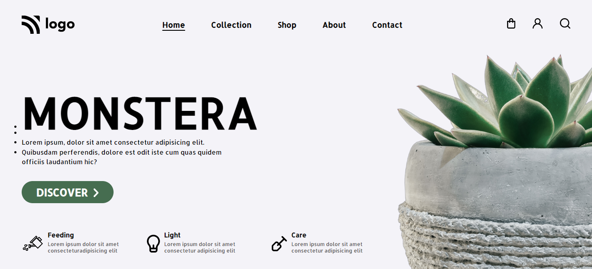

# Plant Home Page

***
## Description

This project [Plant Home Page]() was built using Semantic HTML and CSS. While building this webpage I learnt about id selectors which are unique for an element and various Css properties and flexbox properties. The Project was completed under guidance of [Hitesh Choudhary](https://github.com/hiteshchoudhary), CTO Ineuron

***
### Links for Project

* [LIVE Project Link]()

* [Youtube Video Demo]()

* [Source Code]()

***
### Built With 

* Semantic HTML
* FlexBox
* ID Selectors

***

### Key Learnings

* Learned using [flexbox](https://developer.mozilla.org/en-US/docs/Web/CSS/flex)

* Learned about how to position image at the desired loaction on the webpage

***

### Time Taken to finish this project
 

>2 hour

 

***

### Screencapture of Project

 

***

### Checkout Portfolio & Other Projects
 

#### [Personal Portfolio]()

#### [Findcoder Profile]()
***

### Connect with Me
* [Mailto](mailto:shubhambhoj3@gmail.com)
* [LinkedIn]()
* [Github]()
* [Findcoder]()
***
***
[go to top](#plant-home-page)